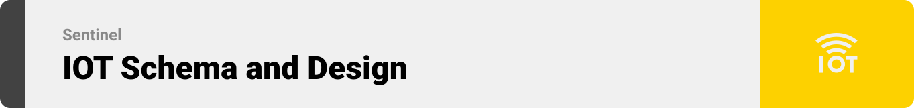

<br><br>

<!-- project philosophy -->


> Sentinel: Smart Safety Helmet
> Sentinel is a project that supports cutting-edge technology to enhance worker safety on construction sites. With a focus on proactive safety measures, real-time monitoring, and efficient emergency response, our platform ensures a secure and compliant working environment for all. From object detection to gas monitoring and precise GPS tracking, the Smart Safety Helmet empowers workers and site managers to operate with confidence. Join us in revolutionizing workplace safety with our innovative smart helmet solution.

### User Wrokers
- As a worker, I want to receive alerts about emergencies related to temperature, humidity, gas leaks and underground conditions so that I can take immediate action for my safety.
-  As a worker, I want to be able to call my personal contacts and my specific emergency contacts in case of an alert so that I can ensure help is provided quickly

### Admins Stories
- As an admin, I want the system to detect if workers are wearing helmets so that I can ensure compliance with safety regulations
- As an admin, I want to record instances of workers not wearing helmets so that I can address safety violations.
- As an admin, I want to track workers' locations via GPS and indoor tracking so that I can ensure their safety in real-time.
- As an admin, I want to receive alerts about emergencies so that I can respond promptly and ensure worker safety.

<br><br>

<!-- Tech stack -->


###  Sentinel is built using the following technologies:

- This project uses the Flutter app development framework. Flutter is a cross-platform hybrid app development platform which allows us to use a single codebase for apps on mobile, desktop, and the web.
- For the backend, the project utilizes Node.js, a powerful JavaScript runtime built on Chrome's V8 engine that allows for scalable and efficient server-side development.
- For trusted database foundation, the app uses the MongoDB Atlas that enables you to work with data the way you want easily and effortlessly.
- The app integrates with Firebase for real-time database, authentication, and cloud storage, providing a robust and scalable backend infrastructure.
- The project employs a ML framework, enabling real-time helmet detection to ensure worker compliance with safety protocols.
- To connect the Arduino to the server, I used the ESP32-WROOM-32D, a powerful Wi-Fi and Bluetooth microcontroller from Espressif Systems. This module features a dual-core processor and a full TCP/IP stack, making it ideal for IoT applications and reliable network communication.


<!-- <br><br> -->

<!-- Features


> Sentinel focuses on the safety of workers against the following hazards.
 -->


<br><br>


<!-- App Routings -->


> Sentinel's support app runs as follows.


<br><br>

<!-- UI UX -->


> I designed Sentinel using wireframes and mockups, iterating on the design until i reached the ideal layout for easy navigation and a seamless user experience.


- Project Figma design [figma](https://www.figma.com/file/LsuOx5Wnh5YTGSEtrgvz4l/Purrfect-Pals?type=design&node-id=257%3A79&mode=design&t=adzbABt5hbb91ucZ-1)


<!-- ### Mockups
| Home screen  | Menu Screen | Order Screen |
| ---| ---| ---|
|  |  |  | -->


<br><br>


<!-- Implementation -->


### User Screens (Mobile)
| Login screen  | Register screen | Reset Password screen | |
| ---| ---| ---| ---|
|  |  |  | 
| Add Worker screen  | GPS real time tracking Screen |  Worker Live Data screen ||
  |  | | |
  <!--  |  | -->

<br><br>



> Sentinel focuses on the safety of workers against the following hazards.


<!-- ### Admin Screens (Web)
| Login screen  | Register screen |  Landing screen |
| ---| ---| ---|
|  |  |  |
| Home screen  | Menu Screen | Order Screen |
|  |  |  | -->

<br><br>


<!-- Machine Learning -->
   

> In Sentinel, machine learning plays an important role in improving worker safety and compliance. By integrating advanced machine learning algorithms, the helmet can perform real-time image detection to ensure workers are wearing their helmets correctly. This automated monitoring system uses trained models to identify and record instances of non-compliance, allowing for immediate corrective actions. Using the yoloV8 latest model admin can monitor through the arduino camera live feed to detect safety measures 


<br><br>


<!-- Unit Testing -->


###  Precision in Development: Harnessing the Power of Unit Testing:

- This project utilizes thorough unit testing methodologies to uphold code reliability and precision. Through systematic assessment of software components, we establish a robust foundation, promptly detecting and resolving potential issues during development.


<br><br>


<!-- Future Work -->


> This is an example of how you may give instructions on setting up your project locally.
> To get a local copy up and running follow these simple example steps.

### Prerequisites

-   npm
    ```sh
    npm install npm@latest -g
    ```
-   ESP32 (Hardware)

### Installation

1. Clone the repo

    ```sh
    git clone https://github.com/Louay-El-hajj/Sentinel
    ```

2. Install [Node.js](https://nodejs.org/en/)

3. Go to nodejs-server directory
    ```sh
    cd nodejs-server
    ```
4. Install npm packages
    ```sh
    npm install
    ```
5. Run the server
    ```sh
    nodemon .
    ```
6. Install [Flutter SDK](https://docs.flutter.dev/get-started/install?gclid=Cj0KCQiAveebBhD_ARIsAFaAvrEXbca0gKEuW9ROxwC86eiEtJUUO5tm-AIIzds41AXpzsjkbESCw2EaAsTwEALw_wcB&gclsrc=aw.ds)

7. Go to flutter_app directory
    ```sh
    cd flutter_app
    ```
8. Install pub packages
    ```sh
    flutter pub get
    ```
9. Run flutter_app
    ```sh
    flutter run
    ```
<br><br>

With ongoing development and refinement, we remain committed to revolutionizing safety standards and shaping the future of workplace environments.

